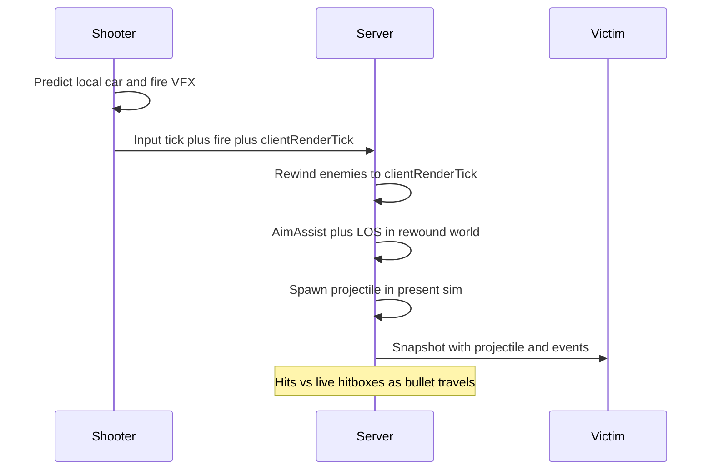
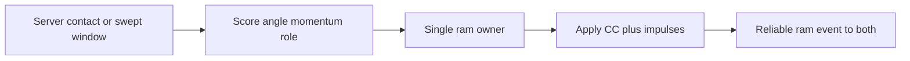
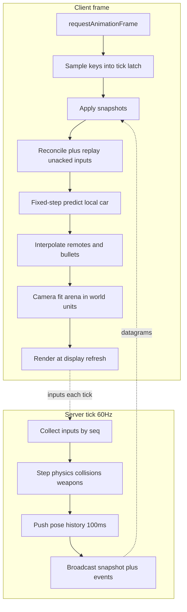

# Netcode and client architecture

## Verdict: 70–80 ms is the right bar

Yes. For a **2D top-down, high-TTK (4+ s), projectile, no-mouse-aim** brawl, **70–80 ms RTT** is a standard competitive region (Rocket League, Brawl Stars, Diep.io-likes all live here). It is **not** “feels LAN,” and it is **the wrong bar** for hitscan peek-shooters or 1-frame melee fighters.

Why it works here:

- 80 ms is about **2% of a 4 s life**, vs ~10% of a 0.8 s twitch TTK.
- Driving is arcade (highly predictable). Weapons are projectiles (you dodge a thing in the world, not a hitscan instant).
- The remaining pain points are **ramming contact** and **aim-assist lock disagreement**. Those are solvable with the model below, not by chasing 20 ms ping.

Hard constraint this implies: **projectile travel time across a typical fight should be well above RTT** (aim for ≥200–300 ms to cross a mid-range engagement). If shots are almost hitscan-fast, 80 ms becomes unfair again.

Matchmaking should region-gate so most games sit **under ~80 ms**, and the sim should still *function* (not feel fair) out to ~120–150 ms.

---

## Three approaches (recommendation: B)

**A. Diep.io / classic browser arena**
Server simulates. Client predicts only local movement. Remotes are interpolated. Shots and rams use **current server positions** with no rewind. WebSocket snapshots.

- Pros: simplest, hard to cheat, proven in browsers.
- Cons: at 80 ms you shoot/ram at ghosts; aim-assist on the client will disagree with the server; ramming feels mushy.

**B. Server-authoritative + local prediction + fire-time rewind (recommended)**
Same as A, plus: (1) **aim-assist and shot spawn** evaluated on a short rewind of what the shooter was seeing, (2) **projectiles then fly in present-time** against live hitboxes, (3) **ramming is a server contact-scoring window**, not a client-predicted stun. WebTransport datagrams with WebSocket fallback.

- Pros: shooting and locking match the picture on screen; dodging still works; rams have a fair winner; browser-cheat-resistant.
- Cons: more code (history buffer, reconciliation, two timelines). Worth it.

**C. Full rollback / lockstep (GGPO-style)**
Deterministic world, predict all 6 cars, rewind on mismatch.

- Rejected: 6-player physics + projectiles + LOS in JS is a determinism nightmare; lockstep input delay of 80 ms makes driving feel dead; overkill for 4 s TTK.

---

## What similar games actually do (mapped to this game)

- **Brawl Stars (closest design analog: 3v3, auto-aim, no mouse, abilities):** server decides hits and auto-aim. Clients interpolate others and feel their own shot immediately. High ping → “I locked the guy I saw” vs “server locked where he is now.” We copy the **server auto-aim**, but evaluate it on a **rewound snapshot** so lock matches the cone the player saw.
- **Diep.io (closest presentation analog: 2D browser arena, projectiles):** WebSocket, sparse entity updates, local tank predicted, bullets interpolated. No serious car-car CC. We copy **world-space sim + interpolation**, not their lack of lag compensation.
- **Rocket League (closest physics analog: car contact under latency):** predict local car, interpolate/extrapolate others, server owns contact. Failure mode is phantom bumps. We **do not** try to fully predict opponent cars. We resolve rams on the server with a **short contact window** instead of Rocket League’s 120 Hz dual-sim.
- **Overwatch-style projectile lag comp:** rewind is for **fire confirmation**, then the projectile lives in the present. We use that split: **rewind for aim-assist + muzzle direction only; never homing; never rewind the whole bullet lifetime** (that would fake hitscan).
- **Fighting-game rollback:** not the primary model. Steal only “inputs are tick-quantized” and “cooldown is in ticks, not frames.”

---

## Authority split

Server is the only place that may:

- Move cars for real, resolve car-car and car-obstacle collisions, apply ram CC
- Run aim-assist, LOS, fire validation, projectile/beam/melee hitboxes, damage, kills, score
- Start respawn timers and spawn immunity

Client may:

- Predict **local car driving + local muzzle VFX/projectiles** instantly
- Interpolate **everyone else and world projectiles** for display
- Show a **cosmetic** aim-assist highlight (can be wrong; server wins)

Never: client-reported hits, client-chosen lock target as truth, pixel-space cones, frame-based fire rates.

---

## Tick, time, and transport

- **Sim timestep:** fixed `dt = 1/60` on server and in client prediction. Never step physics with `requestAnimationFrame` delta.
- **Network snapshots:** 60 Hz for 6 cars is cheap; if you ever drop to 30 Hz, include velocity/angular velocity so interpolation stays smooth.
- **Interpolation delay:** adaptive ~50–80 ms (jitter buffer). Player with 80 ms RTT sees remotes ~90–120 ms in the past. That is correct.
- **Rewind cap:** **100 ms** of pose history (covers 80 ms + jitter). Larger rewind is a cheat vector (“I shot where you were”).
- **Clock:** server tick is truth. Client estimates server time from snapshot arrival + half-RTT, smoothed. Fire packets carry `clientRenderTick` (the tick the shooter was displaying for remotes).
- **Transport:** **WebTransport** datagrams (unreliable unordered) for inputs/snapshots; reliable streams for match events (kill, spawn, score, fire ack). **WebSocket fallback** (TCP) for UDP-blocked networks — same protocol, worse loss behavior. Do not start on WebRTC DataChannels for client-server (ICE/TURN tax; WebTransport is the 2026 client-server fit).
- **Bandwidth:** full arena is always visible → send the whole 6-car + projectile set. No interest management.

Inputs are a small struct per tick: `seq, steer, throttle, brake, fire, powerSlot`. Keys sampled every frame, **latched into the next sim tick**. A 144 Hz display cannot fire or turn more often than 60 Hz.

---

## Driving, ramming, and collision

Arcade vehicle: accel, drag, turn-rate vs speed, optional boost. Same function on client and server (shared TypeScript module).

**Static obstacles:** client can predict local car vs map geometry (same map data). Projectiles and aim-assist **must LOS-trace** on the server; walls block lock and shots.

**Car-car (the hard part):** you cannot honestly predict the opponent — their last ~80 ms of input is unknown. Do this:

1. **Server** is the only one that applies ram CC.
2. On contact (or near-contact within a **~80–100 ms swept window** of both cars’ recent poses), score the interaction: relative velocity, contact normal, attacker-to-victim heading (rear / flank / head-on). Highest score wins; **never stun both**.
3. Rear/flank = CC (short steer scramble / drag spike). Head-on = mostly bounce, little or no CC. Outcome uses **momentum and angle**, as you wanted.
4. **Attacker client:** may play a predicted bump (camera shake, spark) if your predicted hull overlaps an **extrapolated** opponent. If the server disagrees, cancel the VFX; do **not** locally stun them.
5. **Victim client:** CC starts when the snapshot says so (~one-way delay). At 4 s TTK this is acceptable; fake local stuns cause “I wasn’t hit” fights.

Reconcile local car with **soft correction** under a position error threshold (blend), hard snap only on teleport / stun / spawn.

---

## Weapons, aim-assist, and hits

**Aim-assist geometry is world-space, never screen-space.** That is how resolution/zoom cannot change lock size.

Shape you described, in world units:

- From the car’s front center, a cone of half-angle `θ` out to range `R1`
- Then a rectangle of width `W = 2 * R1 * tan(θ)` from `R1` to `Rmax` (the cone’s sides are “cut off,” then it continues as a box)

Server at fire:

1. Rewind **other cars** to `clientRenderTick` (clamped to 100 ms).
2. Test candidates vs that polygon + **LOS** (first wall hit loses).
3. Pick by a fixed order, e.g. closest to centerline, then closest range, then lowest entity id (deterministic ties).
4. Lock sets **exit direction only** (optionally toward a **lead point** using rewound velocity). Projectile does **not** home.
5. If empty cone: fire along facing.
6. Spawn projectile at **present** muzzle with that direction. Simulate vs **present** hitboxes + walls.

Client may draw the same cone and a predicted highlight using interpolated enemies. Mismatch should be rare if rewind is correct; if it happens, the shot still goes where the **server** locked.

Weapon families (all server-sim, no hitscan):

- **Single / multi projectile:** server spawns N pellets with spread around the lock (or facing). 360° pellet weapons: **aim-assist off**; directions are in car space.
- **Beam:** direction locked at press (or follows facing if that weapon is designed to steer). Each tick the server traces the segment vs live targets and walls. Do **not** re-run aim-assist every beam tick (that becomes a lag-tracking auto-aim).
- **Melee:** short-lived world hitbox / lunge, validated in present time after facing/lock at start. Generous duration (several ticks), not a 1-frame sweet spot.

**Favor-shooter vs favor-dodger:** fire-time lock favors the shooter; travel-time hits favor the dodger. That split is the fairness model. Do not rewind victim hitboxes for the whole bullet flight.

Spawn immunity: server flag, no damage, no CC; still solid so you cannot overlap. Spawn points chosen maximin vs living enemies.

---

## Client architecture (smoothness + display fairness)

Keep **sim** and **render** apart.

Layers (separate modules, shared physics types with the server):

- `Input` — keyboard latch, no gameplay in raw rAF
- `NetClient` — send inputs, recv snapshots/events, RTT estimate
- `Prediction` — local vehicle only
- `Interpolation` — others, projectiles, beams
- `Camera` — **fit the whole arena + padding to the viewport**. Zoom/resolution only change pixels-per-meter, never meters. Letterbox/pillarbox; do not crop the arena (cropping would hide fights and change information).
- `Renderer` — Pixi (or Canvas2D) draws interpolated state
- `HUD` — HP, score, cooldowns from **server events**, not local guesses

**Refresh-rate fairness (60 vs 144 vs 240 Hz):**

- Physics, fire cooldown, ram windows, beam ticks = **sim ticks**
- Render just interpolates; extra Hz only makes motion smoother (cosmetic advantage, unavoidable, tiny at 4 s TTK)
- Do not accumulate more than ~4 physics catch-up steps per frame; then slow down (avoid spiral-of-death on a stuttering tab)

**Resolution / DPR / zoom fairness:**

- Hitboxes are circles/capsules/OBBs in meters
- Aim cone in meters
- Debug overlay draws world shapes, not sprite bounds
- CSS pixels and `devicePixelRatio` affect canvas sharpness only

**Browser gotchas:** background tabs throttle rAF — last input repeats or car coasts; match does **not** pause. Visibility change should flag the player AFK, not freeze the server.

---

## What we will write after you approve

This repo is empty; the deliverable is the design, not game code yet.

1. Spec: [docs/superpowers/specs/2026-08-28-netcode-and-client-architecture-design.md](docs/superpowers/specs/2026-08-28-netcode-and-client-architecture-design.md) — full protocol, tick model, aim-assist algorithm, ram scoring, client loop, fairness rules, anti-cheat assumptions, test plan (fake 80 ms / jitter / loss).
2. A Cursor canvas beside chat that maps latency problems → solutions → tick timelines, so the architecture is reviewable visually rather than as a wall of markdown.

No simulation code in this pass unless you ask for a follow-up implementation plan.